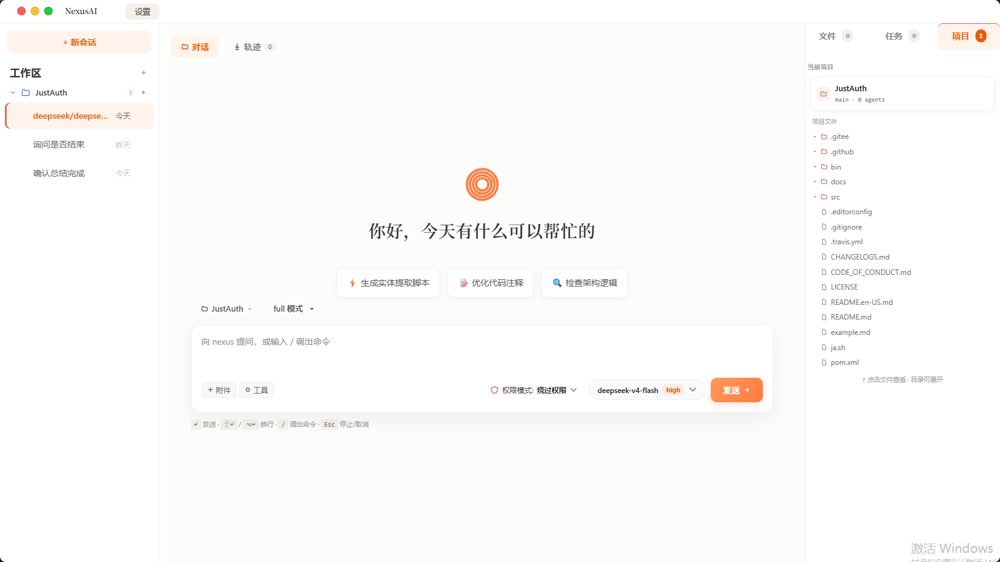
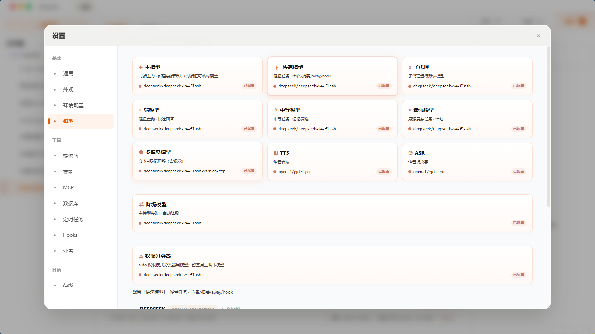
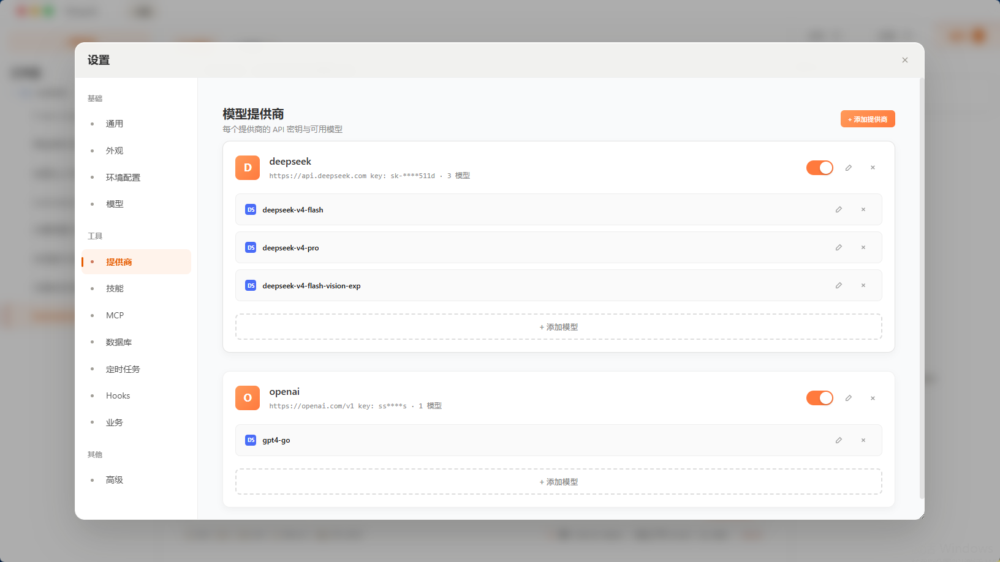
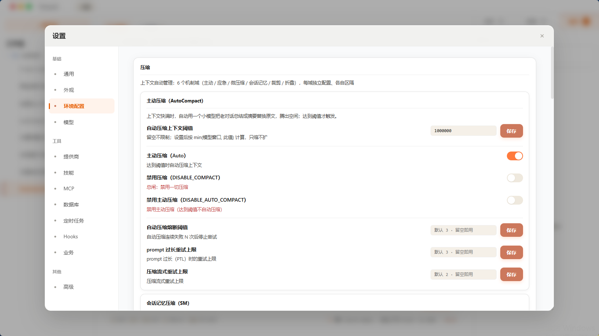
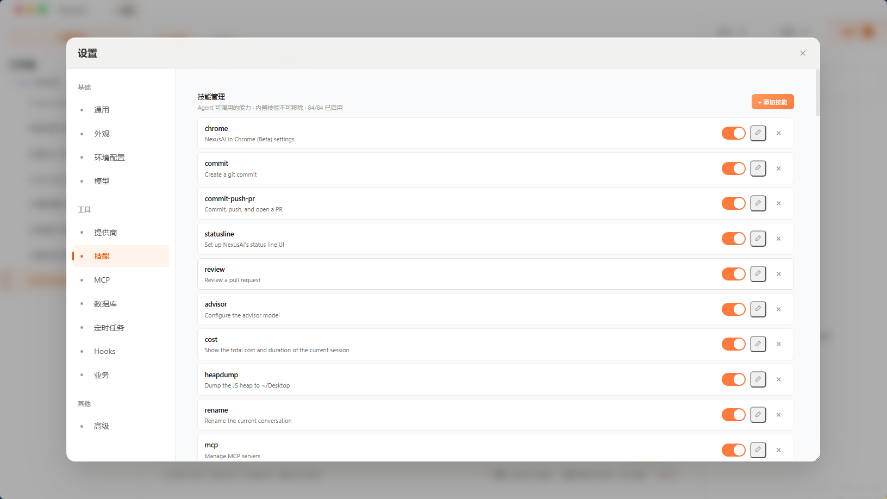
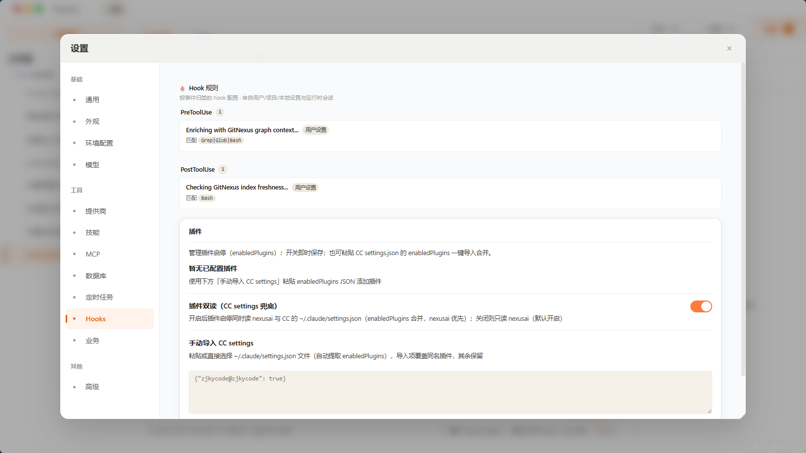
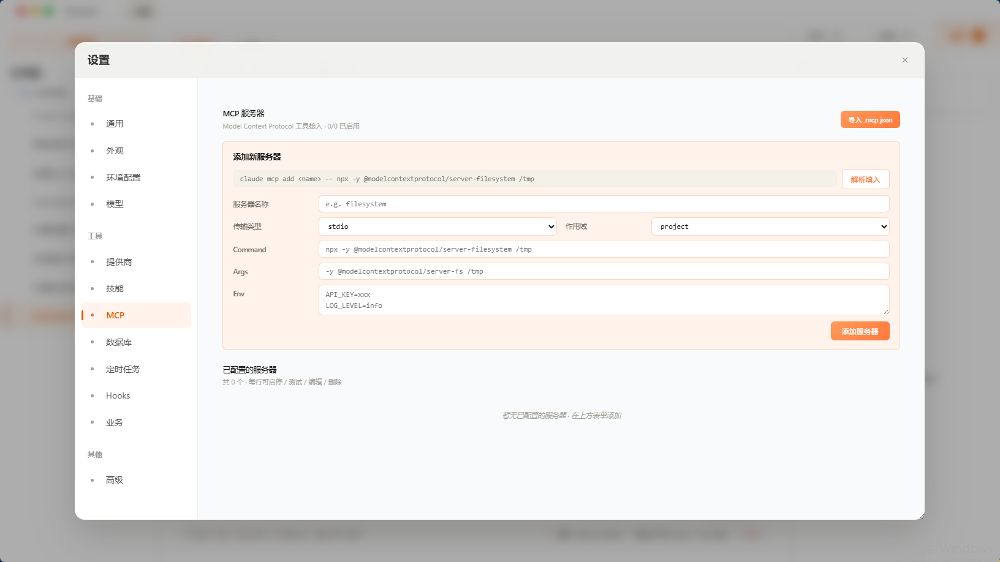
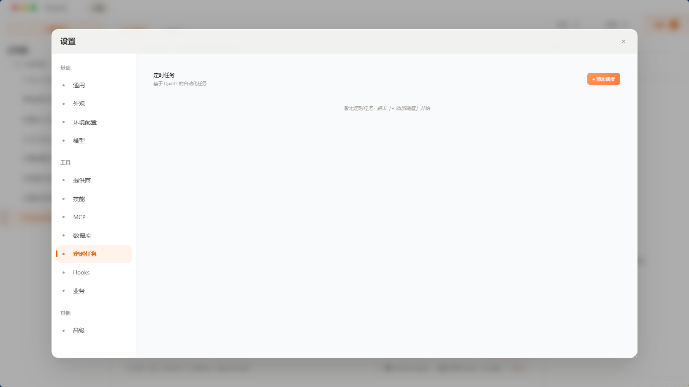
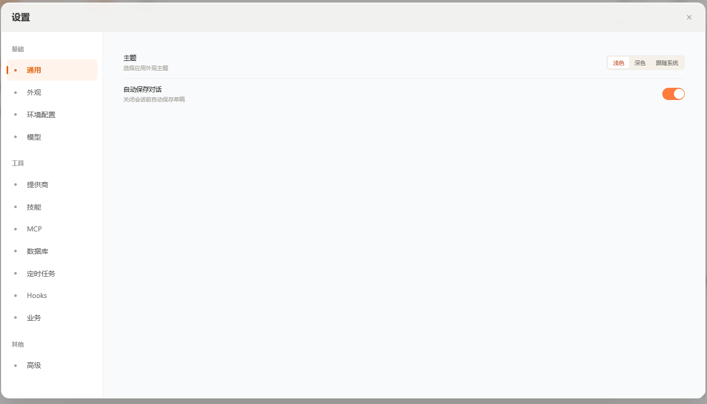

# claude-harness-java

**English** | [**中文**](README.zh-CN.md)

**A Java implementation of the Claude Code agent harness — Spring Boot backend + Web/Tauri frontend.**

`claude-harness-java` re-implements the architecture and behavior of [Anthropic Claude Code](https://github.com/anthropics/claude-code) in Java (the "harness": agent loop, tools, permissions, hooks, skills, memory, team, cron), paired with a web / desktop frontend. It is **model-agnostic** — it speaks the Anthropic Messages API and the OpenAI-compatible protocol, so it works with Claude and other models (e.g. DeepSeek) via configurable providers.

> ⚠️ This is an independent, from-scratch Java re-implementation inspired by Claude Code's public behavior. It does **not** contain Anthropic's proprietary source code.

## What's inside

| Directory | Description |
|-----------|-------------|
| `src/` | Java backend (`nexusai`), Spring Boot 3.5 + SQLite + MyBatis-Flex |
| `frontend/` | Web frontend (React) + optional Tauri desktop shell + browser extension |

## Screenshots

<p align="center">
  
</p>

The main workspace — session list, streaming chat, tool-call visualization, permission bubbles and async-task panels.

**Everything below is configuration stored in SQLite and editable from the UI — no hardcoded keys.**

| | |
|---|---|
|  |  |
| **Model registry & pricing** | **Providers** (base URL / API keys) |
|  |  |
| **Environment & feature toggles** | **Skills & slash commands** |
|  |  |
| **Plugin management** | **MCP servers** |
|  |  |
| **Cron schedules** | **Settings overview** |

## Features

**Agent core**
- Multi-session agent loop with unified prompt queue, mid-turn interruption (Esc), queueing, and context compaction
- Streaming responses over STOMP/WebSocket (SSE-style message stream)
- Anthropic Messages API + OpenAI-compatible providers (DeepSeek etc.), configurable model/provider/price in DB
- Multi-modal routing: text models delegate image & PDF analysis to a dedicated vision model via the `vision_analyze` tool (PDF rendered page-by-page to images)

**Tool system** (aligned with Claude Code)
- Bash/Shell with security AST parsing, File read/write/edit, Glob/Grep/LSP
- WebSearch / WebFetch
- Task management (`TaskCreate/Get/List/Update/Stop/Output`), Workflow
- `ToolSearch` (lazy-loading tools, including an OpenAI-compatible fallback that returns full schemas)
- Cron scheduling, Team & sub-agent orchestration, SendMessage
- MCP clients (DB-configured)

**Extensibility**
- Permissions engine + hook system (SessionStart / PreToolUse / PostToolUse / …)
- Skills & slash commands, plugin loading (ZJKYCode-compatible)
- Conversation memory with automatic extraction and compaction
- Session-scoped project binding, transcript & session persistence in DB

**Frontend** (`frontend/`)
- Web chat UI with streaming, tool-call visualization, permission bubbles, attachments
- Optional Tauri desktop shell + browser extension (NexusAI in Chrome)

## Architecture

```
┌───────────────────────────────┐
│  frontend/  (React + Tauri)   │
│  chat UI · settings · tools   │
└──────────────┬────────────────┘
               │ REST + STOMP/WebSocket
┌──────────────▼────────────────┐
│  src/  (Spring Boot backend)  │
│  ChatService → AgentLoop      │
│   └─ tools / permissions /    │
│      hooks / skills / memory  │
│  SQLite (MyBatis-Flex)        │
└──────────────┬────────────────┘
               │ HTTP
        ┌──────▼──────┐
        │  Model API  │  (Anthropic / OpenAI-compatible)
        └─────────────┘
```

The Java backend stores all state in SQLite (`nexusai.db`) — sessions, messages, tool results, models/providers, cron schedules, settings — and pushes live events to the frontend over STOMP.

## Getting started

**Backend**

```bash
mvn -q compile
# configure model providers & API keys in the DB (or via the frontend settings page)
mvn spring-boot:run
```

The backend exposes a REST API under `/api/v1` and a STOMP endpoint `/ws`. The web frontend is in `frontend/`; run it with your favorite React tooling:

```bash
cd frontend
npm install
npm run dev
```

Model providers (name, type, base URL, API key, price) are stored in the database and editable from the UI — no keys are hardcoded.

## Aligning with Claude Code

The project aims for behavioral alignment with Claude Code where the architecture permits (the reference is an independent re-reading of its *behavior*, not its code). When something diverges — e.g. openai-compatible models without `tool_reference`, or a Java Spring bean model replacing a TypeScript module — the divergence is deliberate and documented in the code.

## Roadmap & Join us 🚀

**Done**: agent loop · tool system · permissions/hooks · skills/slash commands · memory & compaction · multimodal routing · MCP · cron · team & sub-agent basics · streaming frontend

**Next up**:
- **Workflow orchestration** — deterministic multi-agent / multi-stage pipelines (Plan → Execute → Reflect → global review), resumable
- **Deeper Team collaboration** — member mailboxes, task claiming, permission inheritance & bubbling
- **Plugin system** — Spring-managed capabilities + **class loader hot-loading** of plugin jars + **GraalJS** so the community can write lightweight TS/JS tools/skills

Why this plugin approach is interesting: TS harnesses such as [deepseek-harness](https://github.com/deepseek-ai/deepseek-harness) are built on [Cordis](https://github.com/cordiverse/cordis) — a lightweight TS dependency-injection container where everything is a plugin. Same spirit as Spring IoC, but TS-ecosystem. We build on the JVM equivalent — **Spring IoC + dynamic class loading + GraalJS** — for type safety, lifecycle and governance. If that sounds like a fun architecture problem, there's a large open canvas here.

**We're looking for Java contributors** — see [CONTRIBUTING.md](CONTRIBUTING.md).

## License

[MIT](LICENSE)

---

*Project name `claude-harness-java`; the internal code name is `nexusai`. Not affiliated with Anthropic.*
